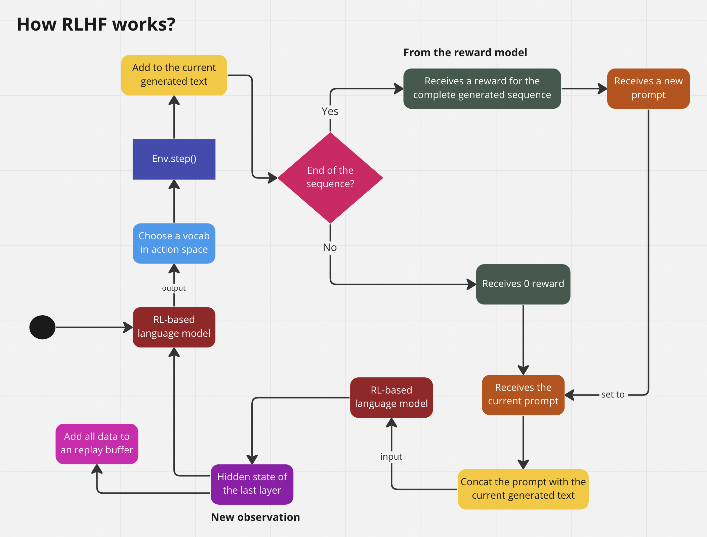

InstructGoose - 🚧 WORK IN PROGRESS 🚧
================

<!-- WARNING: THIS FILE WAS AUTOGENERATED! DO NOT EDIT! -->

Paper: InstructGPT - [Training language models to follow instructions
with human feedback](https://arxiv.org/abs/2203.02155)



### Questions

- In the context of RLHF, how to calculate the $L_t^{V F}(\theta)$,
  - Like it’s a function of the PPO agent uses to predict how much
    reward it gets if generates the sequence?
- ~~Does the RL model and the SFT model use the same tokenizer? Yes~~
- ~~I don’t know how to returns the logit of the generation model~~
- Does the PPO Agent (Language Model) has a value network just like the
  regular PPO Agent?
- I don’t understand how to calculate the advantage in PPO

## Install

``` sh
pip install instruct-goose
```

### Train the RL-based language model

``` python
from transformers import AutoTokenizer, AutoModelForCausalLM
from instruct_goose import RLHFTrainer, create_reference_model, RLHFConfig
```

    /Users/education/DATA/projects/ai/RLHF/instructGOOSE/env/lib/python3.10/site-packages/tqdm/auto.py:22: TqdmWarning: IProgress not found. Please update jupyter and ipywidgets. See https://ipywidgets.readthedocs.io/en/stable/user_install.html
      from .autonotebook import tqdm as notebook_tqdm

``` python
tokenizer = AutoTokenizer.from_pretrained("gpt2")
model = AutoModelForCausalLM.from_pretrained("gpt2")
ref_model = create_reference_model(model)
```

### Train the reward model

### TODO

- Add support batch inference for agent
- Add support batch for RLHF trainer

### Resources

I used these resources to implement this

- Copied the
  [`load_yaml`](https://xrsrke.github.io/instructGOOSE/utils.html#load_yaml)
  function from https://github.com/Dahoas/reward-modeling
- Learned how to build a dataset to train reward model:
  https://wandb.ai/carperai/summarize_RLHF/reports/Implementing-RLHF-Learning-to-Summarize-with-trlX–VmlldzozMzAwODM2
- Learned how to add value head in PPO agent:
  https://github.com/lvwerra/trl
- Learned how to calculate the loss of PPO agent:
  https://github.com/lvwerra/trl/blob/main/trl/trainer/ppo_trainer.py
- Learned how to use PPO to train RLHF agent:
  https://github.com/voidful/TextRL
